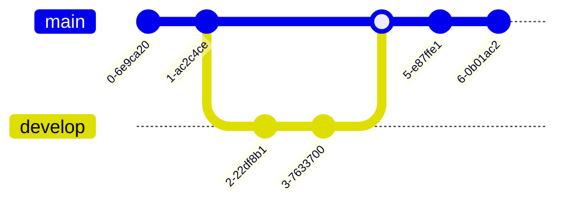

# 🐛 Descripción del Error
Una descripción clara y concisa de qué es el error y cómo te afecta.

## 🔄 Pasos para reproducir
Por favor, ayúdanos a encontrar el error siguiendo estos pasos:

1. Ir a la sección '...'
2. Hacer clic en el botón '....'
3. Escribir en el campo '....'
4. Ver el error que aparece en pantalla.

## 🤔 Comportamiento esperado
Describe qué es lo que **debería** haber pasado si todo funcionara bien.

## 📸 Capturas de pantalla
Si puedes, añade capturas de pantalla o videos para que entendamos mejor el problema.
*(Puedes arrastrar y soltar las imágenes aquí)*.

## 💻 Entorno y Contexto
Información técnica para replicar el error:
* **Sistema Operativo:** [ej. macOS Sequoia, Windows 11]
* **Navegador:** [ej. Chrome, Safari]
* **Versión del proyecto:** [ej. v1.2]
  

---
*Reporte generado con ❤️ por la comunidad.*